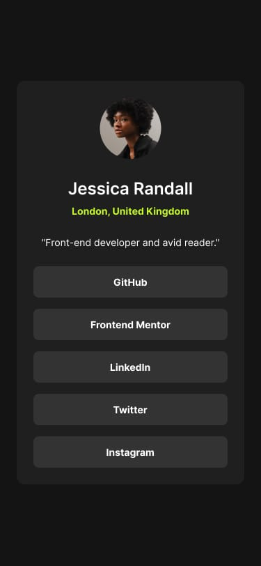
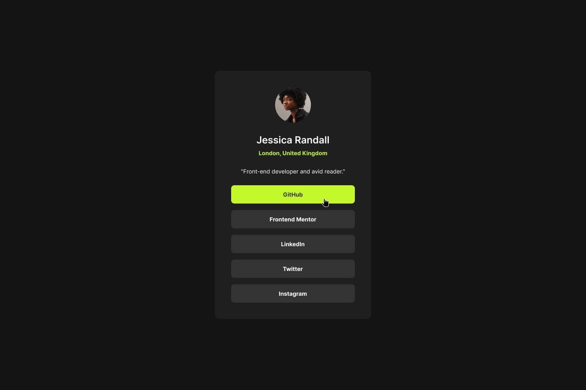

# Frontend Mentor - Social links profile solution

This is a solution to the [Social links profile challenge on Frontend Mentor](https://www.frontendmentor.io/challenges/social-links-profile-UG32l9m6dQ). Frontend Mentor challenges help you improve your coding skills by building realistic projects.

## Table of contents

-   [Frontend Mentor - Social links profile solution](#frontend-mentor---social-links-profile-solution)
    -   [Table of contents](#table-of-contents)
    -   [Overview](#overview)
        -   [The challenge](#the-challenge)
        -   [Screenshot](#screenshot)
        -   [Links](#links)
    -   [My process](#my-process)
        -   [Built with](#built-with)
        -   [What I learned](#what-i-learned)
        -   [Continued development](#continued-development)
        -   [Useful resources](#useful-resources)
    -   [Author](#author)

## Overview

### The challenge

Users should be able to:

-   See hover and focus states for all interactive elements on the page

### Screenshot

### Links

-   Solution URL: [Add solution URL here](https://your-solution-url.com)
-   Live Site URL: [Add live site URL here](https://your-live-site-url.com)

## My process

### Built with

-   Semantic HTML5 markup
-   CSS custom properties
-   Flexbox
-   Desktop-first workflow

### What I learned

-   How to structure a simple component using semantic HTML

-   Using Flexbox to center elements both vertically and horizontally

-   Applying consistent spacing, font styles, and colors based on a design

-   Making a layout responsive for different screen sizes

-   Improving attention to detail by closely matching a given design
-   Working with design assets and style guides.

### Continued development

I’d like to keep improving my skills in responsive design, especially using mobile-first workflows. I also plan to explore adding basic interactivity with JavaScript in future projects and focus more on accessibility best practices to make my components more user-friendly.

### Useful resources

-   [Example resource 1](https://www.w3schools.com) - This helped me refresh my memory on flex display property.

## Author

-   Frontend Mentor - [@yourusername](https://www.frontendmentor.io/profile/usiemeblessing)
